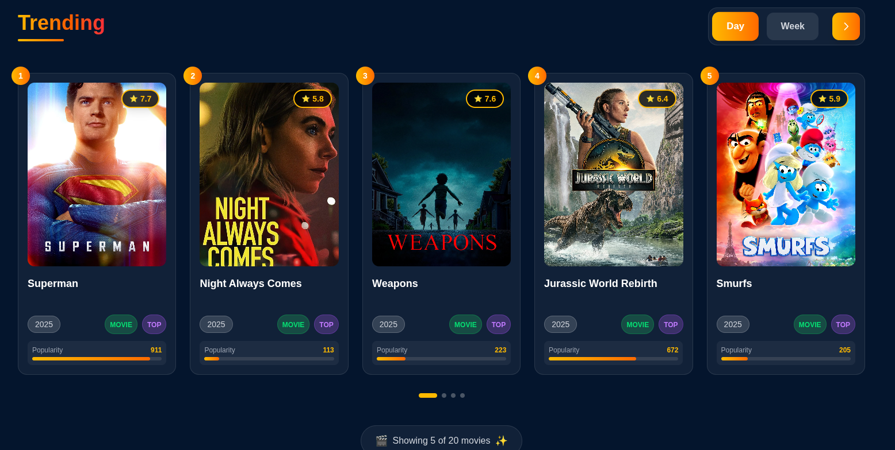

# 🎬 Movix



Movix is a movie web application built with **React, Redux Toolkit, Tailwind CSS**, and **Firebase** for authentication.  
It provides a smooth UI, secure sign-in/sign-up, and real-time movie data fetched from the **TMDB (The Movie Database) API**.

---

## 🚀 Features

- 🔐 **Authentication & Authorization** with Firebase (Sign in / Sign up)  
- 🎥 **Real-time Movies & TV Shows Data** fetched from TMDB API  
- ⚛️ **React** for building UI components  
- 📦 **Redux Toolkit** for state management  
- 🌀 **Tailwind CSS** for fast and responsive styling  
- 🎯 **React Hook Form** for handling forms easily  
- 🛣 **React Router DOM** for navigation and routing  
- 🌐 **Context API** for sharing state across components  
- 🔥 **Firebase Backend** to handle user authentication  

---

## 🛠 Tech Stack

### Frontend
- React  
- Redux Toolkit  
- React Hook Form  
- React Router DOM  
- Context API  
- Tailwind CSS  

### Backend
- Firebase Authentication (Sign in / Sign up)  

### API
- [TMDB (The Movie Database)](https://www.themoviedb.org/) for movies & TV shows  

---

## 📂 Project Setup

1. **Clone the repo**
   ```bash
   git clone https://github.com/your-username/movix.git
   cd movix
